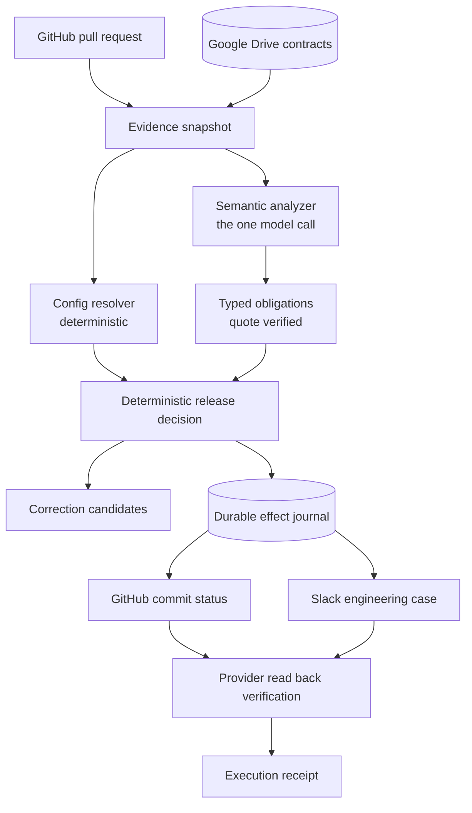

# ClauseCI

**Customer aware CI for B2B SaaS release decisions.**

ClauseCI reads a proposed GitHub configuration change, interprets the agreements
that govern each customer, detects contract specific release conflicts, proposes
a customer scoped correction, publishes the required GitHub check, maintains the
Slack engineering case, and verifies the workflow after correction.

**Live interactive demo:**
https://clauseci-2jfpnwaqmsyjncrph7ythl.streamlit.app/

**2-minute demo:**
https://youtu.be/DaPaS8VFcYM

## The example

A platform team raises log retention from 30 days to 90 days. Two lines, in one
`defaults` block. It looks harmless.

The same change moves three customers at once.

- **Globex** may keep application logs for 90 days. Their agreement allows it.
- **Acme Labs** may keep them for 180 days. Well within.
- **Acme Corporation** signed an amendment in August capping application,
  diagnostic **and** audit logs at 30 days. That document is in a Drive folder
  nobody on the pull request has open.

Rolling everyone back to 30 days would fix the breach and throw away the
behaviour two customers are entitled to. ClauseCI proposes a customer scoped
configuration instead.

| | Acme Corporation | Globex | Acme Labs |
|---|---|---|---|
| Requested | 90 | 90 | 90 |
| Naive rollback | 30 | 30 | 30 |
| **ClauseCI correction** | **30** | **90** | **90** |

Those numbers are application and diagnostic retention in days, per customer.
The correction preserves **4 of 6** requested category outcomes, and **2 of 3**
customers keep the behaviour that was asked for.

What then happened, for real, on this repository's own demo pull request:

| | Commit | Decision | Required check | Slack case |
|---|---|---|---|---|
| Original | `ed423b0b` | **CONFLICT** | failure | OPEN |
| After a developer applied the correction | `a47f5657` | **PASS_SCOPED** | success | same case, **RESOLVED** |

The unsafe commit keeps its failing check permanently. The corrected commit
earned its own. One engineering case spans both.

**ClauseCI proposed the correction. A developer applied it. ClauseCI then
verified the new commit and closed the workflow.**

## What ClauseCI does

ClauseCI is a customer aware release decision agent for B2B SaaS. One run does
all of this:

1. **Reads a proposed GitHub configuration change**, bound to the exact commit.
2. **Resolves the effective configuration per customer**, so a change to one
   default is visible as a change to three accounts.
3. **Reads the governing agreements from Google Drive**, read only.
4. **Interprets contract language into typed obligations**, each carrying a
   verbatim quote that must actually state the number being claimed.
5. **Detects customer specific release conflicts** against those obligations.
6. **Proposes a scoped correction** that keeps the request wherever the
   agreements permit it, instead of rolling everyone back.
7. **Publishes the GitHub release check** under
   `ClauseCI / retention-compliance`.
8. **Maintains the engineering case in Slack**, one case across the lifecycle.
9. **Verifies external provider state** by reading GitHub and Slack back and
   comparing the fields before anything is called done.

## External apps used

Three external applications carry the workflow. A fourth, OpenRouter, is the
model API and is described separately below.

### GitHub

- Read the pull request and the exact commit SHA under review.
- Inspect the configuration changes the pull request proposes.
- Publish the required commit status `ClauseCI / retention-compliance`.
- Bind the release decision to the analyzed commit, so a later commit never
  inherits an earlier verdict.

The unsafe commit keeps its failing check permanently. A corrected commit earns
its own.

### Google Drive

- Read the customer agreement corpus.
- Obtain the contract evidence the semantic analyzer works from.
- Provide read only source material, including the digest each decision is
  bound to.

**ClauseCI does not mutate Google Drive.** The OAuth scope is `drive.readonly`,
so no write is possible, and the evaluation records zero Drive mutations.

### Slack

- Create one engineering case when a conflict is found.
- Update that same case through the lifecycle.
- Resolve that same case when the corrected commit passes.
- Verify the external state by reading the message back and comparing every
  meaningful field.

One case spans both commits. Duplicate root cases measured: zero.

### OpenRouter

The model API used for one thing only: interpreting contract language into
typed obligations. The model is given no tools, so it cannot write a status,
post a message or call an API. Everything that controls a release decision or
an external action is deterministic code.

## Why this needs an AI agent

Contract language is heterogeneous and semantic. Three Acme documents disagree:
an executed 2025 agreement says 180 days, an executed 2026 amendment says 30,
and a newer but unsigned draft proposes 365. Reading which one controls, and for
which categories, is a language problem.

Everything after that is not. Customer identity, source eligibility,
configuration resolution, predicate evaluation, candidate construction,
authorization, provider writes, verification and recovery are all deterministic
code. The model is given no tools, so it cannot act on anything it reads.

## Architecture



## Supported scope

Supported: customer specific log retention configuration, over application logs,
diagnostic logs, and audit logs where a clause actually names them. Three
customers. GitHub, Google Drive and Slack.

Not claimed: general legal compliance, all contract clauses, verification that
production actually deleted anything, backup compliance, automatic merge,
automatic remediation, or any email workflow.

A pass is a **scoped release decision** over the represented supported retention
predicates, for one recorded configuration and one recorded source snapshot.

## Safety boundaries

- The model interprets language and returns structured data. It is given no
  tools and cannot write a status, post a message or call an API.
- A quote must occur verbatim in the source **and** actually state the number
  being claimed. A real sentence that mentions no number cannot justify one.
- A source belonging to another legal entity, not executed, or not yet
  effective cannot establish a current obligation. No model is consulted for
  that.
- `NO_REPRESENTED_OBLIGATION` is never treated as permission.
- The product command is read only by default. `--execute` is the only path to
  a provider write. Google Drive is read only at the OAuth scope.
- Code from the analyzed pull request is never executed.
- ClauseCI does not merge pull requests and does not push remediation
  commits. A developer applies the correction. A test greps the runtime
  package to keep it that way.

## Reliability and evaluation

### What was tested

ClauseCI was tested across ten areas, not only on whether it gets the answer
right:

- semantic interpretation of heterogeneous contract language
- deterministic release decisions
- false greens on unsafe or unresolved cases
- safe case completion
- lost response recovery
- restart reconciliation
- stale SHA handling
- duplicate Slack case prevention
- provider read back verification
- the full multi app lifecycle

### How it behaves under uncertainty


ClauseCI records intended effects before execution and reconciles uncertain
writes against provider state before retrying. **This is not exactly once
execution and is not claimed to be.**

Intent is written to a local SQLite journal and committed before any provider is
called. If a write lands and the response is lost, the effect is recorded as
`UNKNOWN` rather than guessed at, and the next run inspects the provider and
adopts what is already there. A restart finds the unfinished effect and leaves
exactly one Slack case. Freshness is rechecked before the first write, between
writes, and again before sealing.

In short: ClauseCI records intended external effects before writing them,
treats uncertain outcomes conservatively, reads provider state back, and
reconciles an existing effect instead of blindly duplicating it.

### Measured results

Measured, from `evals/results/latest-summary.json`, which is generated from raw
records. No number below was typed by hand.

| Metric | Result |
|---|---|
| **False greens** | **0 of 11 unsafe or unresolved cases** |
| Semantic scenarios | 10 of 10 unique, real model, cache disabled |
| Decision scenarios | 20 of 20 |
| Kernel scenarios | 20 of 20, local fault injection |
| Lifecycle scenarios | 5 of 5 |
| Live, read only provider confirmation | 5 of 5 |
| Safe case completion | 5 of 5 |
| Recovery | 5 of 5 recoverable fault cases |
| Verified live multi app workflows | 2 of 2 |

Zero duplicate Slack cases, zero wrong target writes, zero unexpected GitHub
contexts, zero Gmail actions, zero Drive mutations, zero autonomous merges.

A false green is a case whose correct answer was CONFLICT or REVIEW_REQUIRED
that came back releasable. Safe case completion exists so that blocking
everything cannot look reliable.

10 unique semantic scenarios produced
20 model dependent executions, because
the high risk ones run three times with the cache off. Repeats are reported
separately and are not counted as extra scenarios.

Separately, the repository has **474 engineering regression tests** passing.
That is engineering evidence, not an evaluation score, and the two are never
added together.

## Setup

### The public evidence console needs nothing

The deployed site at
https://clauseci-2jfpnwaqmsyjncrph7ythl.streamlit.app/ requires **zero provider
credentials**. It reads sanitized evidence committed to this repository, holds
no token, and cannot write anywhere. To run that same console locally:

```bash
python3 -m venv .venv
./.venv/bin/pip install -r requirements.txt
./.venv/bin/streamlit run streamlit_app.py
```

No `.env` is needed for that. The interactive release sandbox on the Overview
tab runs the real deterministic decision engine over the captured obligations,
still with no credentials.

### Read only analysis mode

Analysis reads GitHub, reads Google Drive and calls the model. **It writes
nothing.**

```bash
cp .env.example .env        # then fill in your own credentials
./.venv/bin/python -m pytest tests/ -q
./.venv/bin/python -m clauseci.run --pr 1
```

### Authenticated execution mode

Execution additionally publishes a GitHub commit status and creates or updates
one Slack engineering case, then reads both back. `--execute` is the only path
to a provider write.

```bash
./.venv/bin/python -m clauseci.run --pr 1 --execute
```

Google Drive stays read only in both modes.

## Environment variables

Names only. Never commit values. `.env`, `credentials.json` and `token.json` are
git ignored and have never been committed.

Read only analysis needs:

```
GITHUB_TOKEN            fine grained, single repository, Contents:R PRs:R Metadata:R
GITHUB_OWNER
GITHUB_REPO
GOOGLE_CREDENTIALS_PATH  desktop OAuth client
GOOGLE_TOKEN_PATH        drive.readonly
CONTRACT_DRIVE_FOLDER_ID
OPENROUTER_API_KEY
```

Execution additionally needs:

```
GITHUB_TOKEN             also Commit statuses: Read and write
SLACK_BOT_TOKEN          chat:write, channels:read, channels:history
SLACK_ALERT_CHANNEL_ID
```

No Gmail variable is required.

## Run, read only

```bash
./.venv/bin/python -m clauseci.run --pr 1                 # analyse and print, writes nothing
./.venv/bin/python -m clauseci.snapshot --pr 1            # evidence snapshot only
./.venv/bin/python -m clauseci.obligations --pr 1         # what the agreements say
./.venv/bin/python -m clauseci.decide --pr 1              # the scoped decision
./.venv/bin/python -m clauseci.correction --pr 1          # the proposed patch
./.venv/bin/python -m clauseci.state inspect --pr 1       # the case lifecycle
```

## Execute

```bash
./.venv/bin/python -m clauseci.run --pr 1 --execute
```

**This writes.** It publishes a commit status to GitHub and creates or updates
one Slack engineering case, then reads both back. Nothing else is ever written,
and Google Drive stays read only.

## Evidence console

```bash
./.venv/bin/streamlit run streamlit_app.py
```

Reads captured evidence from disk first, so it stays useful when a provider is
slow. Current provider state is an optional refresh and is labelled separately.

## Evaluation commands

```bash
./.venv/bin/python -m evals.run                   # core, local, never mutates a provider
./.venv/bin/python -m evals.run --mode live       # adds read only provider confirmation
./.venv/bin/python -m evals.audit                 # recomputes the metrics independently
```

## Evidence locations

| What | Where |
|---|---|
| System and reliability brief | [SYSTEM_RELIABILITY_BRIEF.md](SYSTEM_RELIABILITY_BRIEF.md) |
| Architecture in detail | [docs/ARCHITECTURE.md](docs/ARCHITECTURE.md) |
| Evaluation scenarios and results | [docs/EVAL_SCENARIOS.md](docs/EVAL_SCENARIOS.md) |
| Generated evaluation summary | [evals/results/latest-summary.md](evals/results/latest-summary.md) |
| Hero lifecycle evidence, sanitized | [evals/results/hero-lifecycle.json](evals/results/hero-lifecycle.json) |
| Hardening report | [docs/HARDENING.md](docs/HARDENING.md) |
| What existed before the build window | [BUILD_START_REPORT.md](BUILD_START_REPORT.md) |

## Known limitations

- One obligation family, over three log categories, for three customers.
- A synthetic contract corpus of eight documents. Realistic, but written for this.
- Kernel and lifecycle evidence comes from local fault injection, not real
  provider outages.
- The execution lock is local. It does not coordinate across machines.
- Slack marker recovery scans a bounded slice of channel history. It is the
  recovery path, not the normal one.
- A generic provider exception maps to `UNKNOWN`, so some definitively failed
  writes read as uncertain. That is the conservative direction.
- ClauseCI checks configuration, not the running system. It does not verify that
  production actually deleted anything.

## Submission links

- **Live interactive demo:** https://clauseci-2jfpnwaqmsyjncrph7ythl.streamlit.app/
- **2-minute demo:** https://youtu.be/DaPaS8VFcYM
- **Demo pull request:** https://github.com/Pranavsingh431/clauseci-demo-saas/pull/1

## Repository structure

```
clauseci/          runtime package
  adapters/        GitHub, Drive, Slack, OpenRouter. writes live in two files only
  domain/          models, decision, candidates, effects, execution
  journal.py       durable SQLite journal of cases, analyses and effects
  reconcile.py     resolving uncertain effects against provider state
  run.py           the product command
demo_contracts/    8 synthetic contract PDFs
evals/             evaluation runner, oracles, generated results
tests/             474 regression tests
ui/console.py      the Evidence Console
docs/              architecture, evaluation, hardening
```

The separation that matters: `evals/ground_truth/` holds the expected answers
and nothing under `clauseci/` may read it. A test enforces that.
