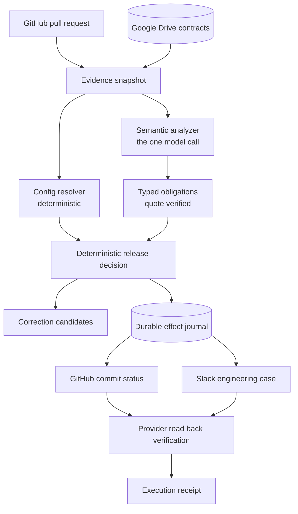

# ClauseCI

**Customer aware release decisions for B2B SaaS.** ClauseCI checks a proposed
configuration change against the customer agreements that actually govern each
account, publishes a scoped release decision on the pull request, proposes a
supported correction, and verifies the engineering workflow across GitHub,
Google Drive and Slack.

## The example

A platform team raises log retention from 30 days to 90 days. Two lines, in one
`defaults` block. It looks harmless.

The same change moves three customers at once.

- **Globex** may keep application logs for 90 days. Their agreement allows it.
- **Acme Labs** may keep them for 180 days. Well within.
- **Acme Corporation** signed an amendment in August capping application,
  diagnostic **and** audit logs at 30 days. That document is in a Drive folder
  nobody on the pull request has open.

Rolling everyone back to 30 days would fix the breach and throw away the
behaviour two customers are entitled to. ClauseCI proposes a customer scoped
configuration instead.

| | Acme Corporation | Globex | Acme Labs |
|---|---|---|---|
| Requested | 90 | 90 | 90 |
| Naive rollback | 30 | 30 | 30 |
| **ClauseCI correction** | **30** | **90** | **90** |

Those numbers are application and diagnostic retention in days, per customer.
The correction preserves **4 of 6** requested category outcomes, and **2 of 3**
customers keep the behaviour that was asked for.

What then happened, for real, on this repository's own demo pull request:

| | Commit | Decision | Required check | Slack case |
|---|---|---|---|---|
| Original | `ed423b0b` | **CONFLICT** | failure | OPEN |
| After a developer applied the correction | `a47f5657` | **PASS_SCOPED** | success | same case, **RESOLVED** |

The unsafe commit keeps its failing check permanently. The corrected commit
earned its own. One engineering case spans both.

**ClauseCI proposed the correction. A developer applied it. ClauseCI does not
commit, push or merge code**, and a test greps the runtime package to keep it
that way.

## What ClauseCI does

1. Reads a pull request and resolves the **effective** retention value for every
   customer, so a change to one default is visible as a change to three accounts.
2. Reads the signed agreements from Google Drive and extracts the controlling
   obligation, with the clause quoted.
3. Decides deterministically, publishes a commit status under
   `ClauseCI / retention-compliance`, and opens one Slack engineering case.
4. Reads both providers back and checks the fields before calling anything done.
5. Proposes a correction for a developer to apply, then verifies the result and
   resolves the same case.

## Why this needs an AI agent

Contract language is heterogeneous and semantic. Three Acme documents disagree:
an executed 2025 agreement says 180 days, an executed 2026 amendment says 30,
and a newer but unsigned draft proposes 365. Reading which one controls, and for
which categories, is a language problem.

Everything after that is not. Customer identity, source eligibility,
configuration resolution, predicate evaluation, candidate construction,
authorization, provider writes, verification and recovery are all deterministic
code. The model is given no tools, so it cannot act on anything it reads.

## Architecture



## Supported scope

Supported: customer specific log retention configuration, over application logs,
diagnostic logs, and audit logs where a clause actually names them. Three
customers. GitHub, Google Drive and Slack.

Not claimed: general legal compliance, all contract clauses, verification that
production actually deleted anything, backup compliance, automatic merge,
automatic remediation, or any email workflow.

A pass is a **scoped release decision** over the represented supported retention
predicates, for one recorded configuration and one recorded source snapshot.

## Safety boundaries

- The model interprets language and returns structured data. It is given no
  tools and cannot write a status, post a message or call an API.
- A quote must occur verbatim in the source **and** actually state the number
  being claimed. A real sentence that mentions no number cannot justify one.
- A source belonging to another legal entity, not executed, or not yet
  effective cannot establish a current obligation. No model is consulted for
  that.
- `NO_REPRESENTED_OBLIGATION` is never treated as permission.
- The product command is read only by default. `--execute` is the only path to
  a provider write. Google Drive is read only at the OAuth scope.
- Code from the analyzed pull request is never executed.

## Reliability model

ClauseCI records intended effects before execution and reconciles uncertain
writes against provider state before retrying. **This is not exactly once
execution and is not claimed to be.**

Intent is written to a local SQLite journal and committed before any provider is
called. If a write lands and the response is lost, the effect is recorded as
`UNKNOWN` rather than guessed at, and the next run inspects the provider and
adopts what is already there. A restart finds the unfinished effect and leaves
exactly one Slack case. Freshness is rechecked before the first write, between
writes, and again before sealing.

## Evaluation

Measured, from `evals/results/latest-summary.json`, which is generated from raw
records. No number below was typed by hand.

| Metric | Result |
|---|---|
| **False greens** | **0 of 11 unsafe or unresolved cases** |
| Semantic scenarios | 10 of 10 unique, real model, cache disabled |
| Decision scenarios | 20 of 20 |
| Kernel scenarios | 20 of 20, local fault injection |
| Lifecycle scenarios | 5 of 5 |
| Live, read only provider confirmation | 5 of 5 |
| Safe case completion | 5 of 5 |
| Recovery | 5 of 5 recoverable fault cases |
| Verified live multi app workflows | 2 of 2 |

Zero duplicate Slack cases, zero wrong target writes, zero unexpected GitHub
contexts, zero Gmail actions, zero Drive mutations, zero autonomous merges.

A false green is a case whose correct answer was CONFLICT or REVIEW_REQUIRED
that came back releasable. Safe case completion exists so that blocking
everything cannot look reliable.

10 unique semantic scenarios produced
20 model dependent executions, because
the high risk ones run three times with the cache off. Repeats are reported
separately and are not counted as extra scenarios.

Separately, the repository has **400 engineering regression tests** passing.
That is engineering evidence, not an evaluation score, and the two are never
added together.

## Quick start

```bash
python3 -m venv .venv
./.venv/bin/pip install -r requirements.txt
cp .env.example .env        # then fill in your own credentials
./.venv/bin/python -m pytest tests/ -q
```

## Environment variables

Names only. Never commit values. `.env`, `credentials.json` and `token.json` are
git ignored and have never been committed.

Read only analysis needs:

```
GITHUB_TOKEN            fine grained, single repository, Contents:R PRs:R Metadata:R
GITHUB_OWNER
GITHUB_REPO
GOOGLE_CREDENTIALS_PATH  desktop OAuth client
GOOGLE_TOKEN_PATH        drive.readonly
CONTRACT_DRIVE_FOLDER_ID
OPENROUTER_API_KEY
```

Execution additionally needs:

```
GITHUB_TOKEN             also Commit statuses: Read and write
SLACK_BOT_TOKEN          chat:write, channels:read, channels:history
SLACK_ALERT_CHANNEL_ID
```

No Gmail variable is required.

## Run, read only

```bash
./.venv/bin/python -m clauseci.run --pr 1                 # analyse and print, writes nothing
./.venv/bin/python -m clauseci.snapshot --pr 1            # evidence snapshot only
./.venv/bin/python -m clauseci.obligations --pr 1         # what the agreements say
./.venv/bin/python -m clauseci.decide --pr 1              # the scoped decision
./.venv/bin/python -m clauseci.correction --pr 1          # the proposed patch
./.venv/bin/python -m clauseci.state inspect --pr 1       # the case lifecycle
```

## Execute

```bash
./.venv/bin/python -m clauseci.run --pr 1 --execute
```

**This writes.** It publishes a commit status to GitHub and creates or updates
one Slack engineering case, then reads both back. Nothing else is ever written,
and Google Drive stays read only.

## Evidence console

```bash
./.venv/bin/streamlit run ui/console.py
```

Reads captured evidence from disk first, so it stays useful when a provider is
slow. Current provider state is an optional refresh and is labelled separately.

## Evaluation commands

```bash
./.venv/bin/python -m evals.run                   # core, local, never mutates a provider
./.venv/bin/python -m evals.run --mode live       # adds read only provider confirmation
./.venv/bin/python -m evals.audit                 # recomputes the metrics independently
```

## Evidence locations

| What | Where |
|---|---|
| System and reliability brief | [SYSTEM_RELIABILITY_BRIEF.md](SYSTEM_RELIABILITY_BRIEF.md) |
| Architecture in detail | [docs/ARCHITECTURE.md](docs/ARCHITECTURE.md) |
| Evaluation scenarios and results | [docs/EVAL_SCENARIOS.md](docs/EVAL_SCENARIOS.md) |
| Generated evaluation summary | [evals/results/latest-summary.md](evals/results/latest-summary.md) |
| Hero lifecycle evidence, sanitized | [evals/results/hero-lifecycle.json](evals/results/hero-lifecycle.json) |
| Hardening report | [docs/HARDENING.md](docs/HARDENING.md) |
| What existed before the build window | [BUILD_START_REPORT.md](BUILD_START_REPORT.md) |

## Known limitations

- One obligation family, over three log categories, for three customers.
- A synthetic contract corpus of eight documents. Realistic, but written for this.
- Kernel and lifecycle evidence comes from local fault injection, not real
  provider outages.
- The execution lock is local. It does not coordinate across machines.
- Slack marker recovery scans a bounded slice of channel history. It is the
  recovery path, not the normal one.
- A generic provider exception maps to `UNKNOWN`, so some definitively failed
  writes read as uncertain. That is the conservative direction.
- ClauseCI checks configuration, not the running system. It does not verify that
  production actually deleted anything.

## Repository structure

```
clauseci/          runtime package
  adapters/        GitHub, Drive, Slack, OpenRouter. writes live in two files only
  domain/          models, decision, candidates, effects, execution
  journal.py       durable SQLite journal of cases, analyses and effects
  reconcile.py     resolving uncertain effects against provider state
  run.py           the product command
demo_contracts/    8 synthetic contract PDFs
evals/             evaluation runner, oracles, generated results
tests/             400 regression tests
ui/console.py      the Evidence Console
docs/              architecture, evaluation, hardening
```

The separation that matters: `evals/ground_truth/` holds the expected answers
and nothing under `clauseci/` may read it. A test enforces that.
